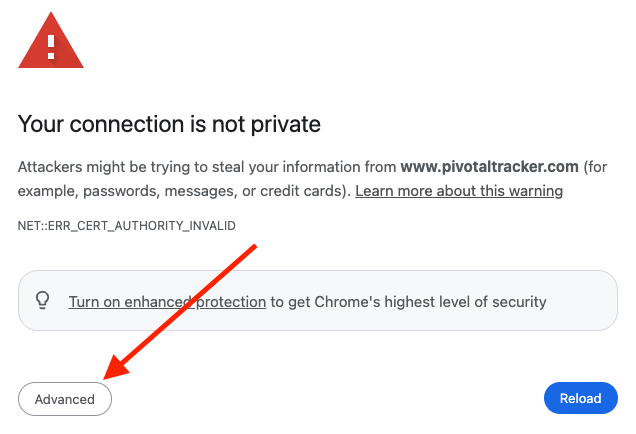
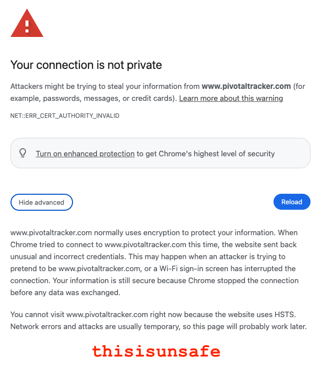

# PT301SC

A proxy that allows you to follow Pivotal Tracker story links to their migrated stories in Shortcut.

## Description

A web server containing a mapping of Pivotal Tracker story IDs to their corresponding Shortcut story URLs. When the "www.pivotaltracker.com" domain is routed to localhost and this proxy is running, it will scrape the incoming URL for the story ID, look up the corresponding Shortcut URL, and redirect to it.

## Getting Started

To get going:

1. Resolve the Pivotal Tracker domain to your localhost.

   ```console
   $ ./scripts/route_pivotaltracker_to_localhost.sh
   ```

2. Start the app

   ```console
   $ ./scripts/start.sh
   ```

3. In your browser, navigate to a Pivotal Tracker URL (using Google Chrome as an example):

   1. e.g. https://www.pivotaltracker.com/story/show/188947849

   2. (The first time) Your browser will warn about an untrusted (self-signed) certificate: \
      

   3. Some browsers (like Google Chrome) will warn again an [HSTS](https://en.wikipedia.org/wiki/HTTP_Strict_Transport_Security) violation: \
    
      type the phrase:
      ```
      thisisunsafe
      ```

      

   4. You should now be redirected to the Shortcut story.


## Configuration

The application reads the mapping between Tracker IDs and Shortcut URLs from a JSON file located at `priv/story_mapping.json`. This file should have the following format:

```json
{
  "188947849": "https://app.shortcut.com/vintro/story/188947849",
  "188947850": "https://app.shortcut.com/vintro/story/188947850"
}
```
where:
- `188947849` is the Tracker story ID
- `https://app.shortcut.com/vintro/story/188947849` is the corresponding Shortcut URL

### Generate the Story Mapping File from a migrated Shortcut workspace

This repo has been preloaded with a `story_mapping.json` file containing most of the migrated Tracker stories in the MO boards.

If you want to generate additional mappings, you can do so following the instructions below.

If your migration tooling set the "external-links" field in your Shortcut stories, you can produce a `story_mapping.json` file directly from your Shortcut workspace (Shortcut's official [Pivotal Tracker importer](https://github.com/useshortcut/api-cookbook/tree/main/pivotal-import) tool _**does**_ set this field).

1. Create a Shortcut API token

   https://app.shortcut.com/settings/account/api-tokens

2. Set the `SHORTCUT_API_TOKEN` environment variable:

   ```bash
   export SHORTCUT_API_TOKEN=<your-api-token>
   ```

3. Extract the story ID mapping from your Shortcut workspace:

   ```bash
   # To generate the story mapping file:
   ./scripts/generate_story_mapping_file.sh
   ```

## Running the Server

```bash
# To start the server directly:
mix run --no-halt
```

By default, the server runs on port 8080 for HTTP and 8443 for HTTPS, so you can access it at:
- HTTP: [http://localhost:8080/](http://localhost:8080/)
- HTTPS: [https://localhost:8443/](https://localhost:8443/)

You can configure the ports using environment variables:

```bash
# To set custom ports:
PT301SC_HTTP_PORT=3000 PT301SC_HTTPS_PORT=3443 mix run --no-halt
```

To test the redirect functionality, visit:
- [http://localhost:8080/story/show/111111111](http://localhost:8080/story/show/111111111)
- [http://localhost:8080/n/projects/2694117/stories/222222222](http://localhost:8080/n/projects/2694117/stories/222222222)

## SSL Certificates

By default (i.e. via the `./scripts/start.sh` script), the application uses self-signed SSL certificates for HTTPS.

These certificates are stored in the `priv/cert/` directory:
- `priv/cert/cert.pem` — The certificate file
- `priv/cert/key.pem` — The private key file

```bash
# To re-generate the certificates:
./scripts/generate_cert.sh
```

## Running in Production

As a mix-based application.

```bash
# To produce a release:
MIX_ENV=prod mix release
```

Then run the release with optional port configuration:

```bash
# To start with default ports (8080 for HTTP and 8443 for HTTPS)
_build/prod/rel/pt301sc/bin/pt301sc start
```

```bash
# To start with custom ports:
PT301SC_HTTP_PORT=80 PT301SC_HTTPS_PORT=443 _build/prod/rel/pt301sc/bin/pt301sc start
```

## Testing

```bash
# To run the tests:
mix test
```
